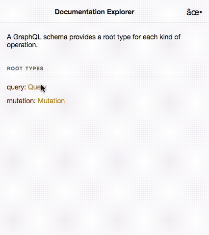

## Vue + Laravel typical cases

### What is it?

Here you can see how to create single page application based on Vue and Laravel with most common features.

This is just an example.


### Frontend

#### Cases:

- Registration/login
- Pagination
- Navigation
- Flash messages
- Simple CRUD
- Validation from laravel
- Preloader

#### What was used:

- ES6 (including stage-3)
- Bootstrap
- Vue
- Vuex (common FLUX implementation for Vue)
- Vue Router
- Axios
- Laravel Mix (API for Webpack)

### Backend

#### Cases:

- Auth controllers based on default scaffolding controllers, but for the JWT (JSON Web Tokens)
- Simple typical Laravel migrations, seeds, models, controllers, routes, tests, middlewares, requests etc

#### What was used:

- Laravel 5.4
- Package "tymon/jwt-auth" - laravel JWT implementation
- Packages "laravel-debugbar", "laravel-ide-helper" - just for development


### What can you see

#### Backend:

- [Routes](routes/)
- [Controllers](app/Http/Controllers/)
- [Jwt middleware](app/Http/Middleware/JwtAuth.php)
- [Validation via request](app/Http/Requests/ArticleRequest.php)
- [Models](app/Models/)
- [Tests](tests/Feature/)
- [Migrations](database/migrations/)
- [Factories](database/factories/)
- [Seeds](database/seeds/)
- [Docker](docker/)

#### Frontend:

- [File webpack.mix.js](webpack.mix.js)
- [Laravel views](resources/views/)
- [App initializing](resources/assets/js/app.js)
- [App structure](resources/assets/js/)
- [Vue components](resources/assets/js/components/)
- [Main component](resources/assets/js/components/App.vue)
- [Vue store structure](resources/assets/js/store/)
- [Vue router](resources/assets/js/router/index.js)

Vue components

- [Login/register](resources/assets/js/components/auth)
- [CRUD example](resources/assets/js/components/article)
- [Flash messages](resources/assets/js/components/Message.vue)
- [Navigation bar](resources/assets/js/components/Navigation.vue)
- [Pagination (via Laravel pagination)](resources/assets/js/components/Pagination.vue)
- [Form inputs](resources/assets/js/components/input)
- [Mixin for auth checking in component](resources/assets/js/components/mixins/Check-auth.vue)

### GraphQL

There is the [GraphQL](https://github.com/dima-loburec/laravel-vue/tree/GraphQL) branch





### How to install (Docker)


Just copy and past:

```bash
git clone git@github.com:dima-loburec/laravel-vue.git
cd laravel-vue/

# frontend:
docker run -v "$PWD":/usr/src/app -w /usr/src/app node:8 npm rebuild node-sass --force && yarn install && yarn run dev

# backend:
cd docker/
docker-compose up -d
# ensure the container name "docker_app_1" via "docker-compose ps" command and run:
docker exec docker_app_1 bash -c "sh docker/app/install.sh"

# open http://localhost:8081/
```

### How to install (Manually)

You need any LAMP/LEMP with PHP5.6+ and MySQL 5.7+

```bash
git clone git@github.com:dima-loburec/laravel-vue.git
# copy .env.example to .env and add your database credentials
# add vhost to your web-server for public folder
# run your composer, artisan, npm/yarn:
sh sh/run.sh
npm run watch
```

If "npm run" doesn't work:

```bash
rm -rf node_modules
npm install
```

Or just try to update node and npm:

```bash
sudo npm install n -g
sudo n stable
sudo npm install npm@latest -g
```

### Run tests

```bash
/vendor/bin/phpunit
```